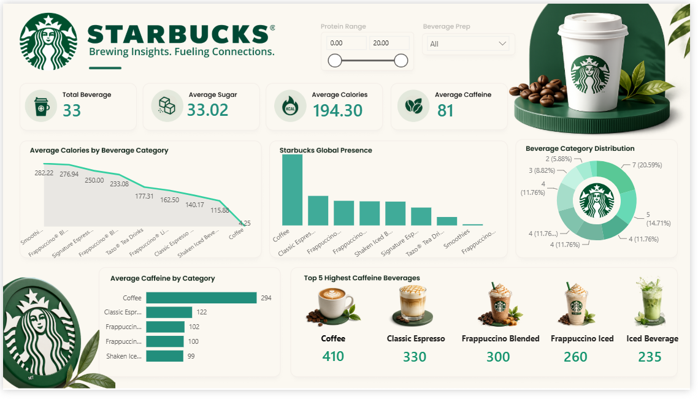

# ☕ Starbucks Beverage Analytics Dashboard

An interactive Power BI dashboard built to analyze Starbucks beverage nutritional information using **Power BI, DAX, and Power Query**.

---

## 📊 Dashboard Preview



---

## 🚀 Features

- Interactive KPI Cards
- Beverage Category Distribution
- Average Calories Analysis
- Average Caffeine Analysis
- Top 5 Highest Caffeine Beverages
- Protein Range Slicer
- Beverage Preparation Filter
- Starbucks-inspired Dashboard Design

---

## 🛠️ Tools & Technologies

- Power BI
- DAX
- Power Query
- Microsoft Excel

---

## 📂 Dataset

- Starbucks Beverage Nutrition Dataset
- Starbucks Store Directory Dataset

---

## 📁 Repository Structure

```
Starbucks-Data-Analysis
│
├── Dashboard
│   ├── starbucks-analysis.pbix
│   └── Dashboard.png
│
├── Dataset
│   ├── starbucks.csv
│   └── directory.csv
│
├── Images
│   ├── coffee.png
│   ├── Classic Espresso.png
│   ├── Frappuccino Blended coffee.png
│   ├── Frappuccino Light Blended Coffee.png
│   ├── Iced Beverages.png
│   └── logo.png
```

---

## 📈 Key Insights

- Identified the beverages with the highest caffeine content.
- Compared nutritional values across beverage categories.
- Built an interactive dashboard with dynamic filtering.
- Enabled nutritional analysis using DAX measures and Power Query transformations.

---

## 👨‍💻 Author

**Jinal Sasiya**
